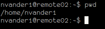

# The Terminal and Shell
Today we will be covering the basics of using a computer from the
terminal. You will learn how to navigate folders, and how to make, 
delete, copy, and move files and folders.

People often confuse the terminal and the shell, since the difference
is subtle. A *terminal* is an environment to input and display
text, and a *shell* is the program that interprets your input in a
terminal.

## Why Use The Terminal?
While graphical user interfaces (GUIs) are helpful for a lot of things,
sometimes command line interfaces (CLIs) are the better tool for the job.

As an example, imagine you have a messy folder, and you want to combine
all the .txt files into a new file called "newfile.txt". If you use a
GUI, this seems like a tedious task, but it only takes one line in the
*shell*.

    cat *.txt > newfile.txt

## Where Is The Terminal?

### Mac OS
1. Open Finder from the Dock.
2. Open your Applications folder.
3. Open Utilities.
4. Double click on Terminal.

### Ubuntu
Hit the keyboard shortcut Ctrl - Alt - T.

### Windows
Windows also has a built-in terminal, Command Prompt; however, Command
Prompt's shell differs greatly from the shells on Mac and Linux. So you will
need to install a shell

In the next workshop, we will be learning the basics of git. Since Git
for Windows comes with a version of BASH (the shell on Mac and Linux),
we recommend that you install it.
You can get it [here.](https://git-for-windows.github.io/)

## Folder Structure
Folders (often called *directories*) on your computer are arranged in a
tree structure. A folder within another folder is called a *subdirectory*.
The folder containing these subdirectories is called the *parent* of the
subdirectories.
There is a folder called the *root* directory ("/" on Mac/Linux, and "C:"
on Windows) that contains all of the computer's files and folders within
its subdirectories. You often see these directories arranged like this:

In this picture, you can see from the navigation bar that these folders are in
is the root ('/').
It is easy to see which folders are parents, which are subdirectories, and
which folders are in the same directory. When you open a terminal, you can
find the same information, but you need to know some commands.

## Print Working Directory and List
In the last picture, we were in '/' (the root directory). We call your currently
open folder the *working directory*. In a GUI, you can see the working directory
in the navigation bar; in a terminal you find it with the command `pwd`. This command,
pwd, is an abbreviation for "Print Working Directory". Open a terminal, type `pwd` and
press Enter. You should see something like this:

## Copying Files
## Making and Deleting Folders
## Moving & Renaming Files
